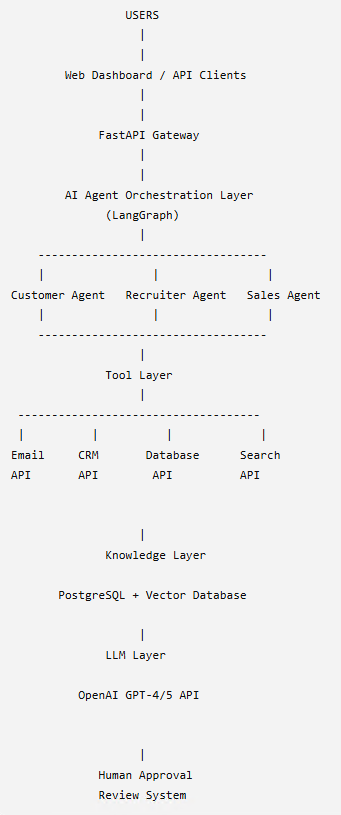

# EnterpriseAI-AgentOS

## Overview

Production-grade multi-agent AI automation platform.

## Features

✓ Multi-Agent Architecture

✓ LangGraph Workflows

✓ RAG Knowledge System

✓ Human-in-the-loop

✓ Enterprise Memory

## Architecture

             
## Demo

(video)

## Installation

docker compose up

## API Documentation

## Roadmap

## Author
